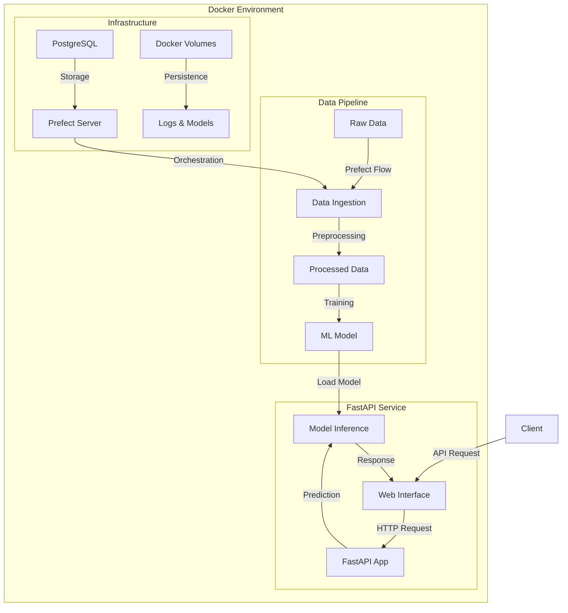

# FastAPI for ML: Iris Classification Service

A production-ready machine learning service that demonstrates the integration of FastAPI, scikit-learn, and Prefect for model training, deployment, and inference. The project uses the classic Iris dataset to showcase a complete ML pipeline with proper logging, monitoring, and containerization.

## Project Overview

This project implements:
- A machine learning pipeline for the Iris classification problem
- A FastAPI web service for model inference
- Prefect workflows for automated data processing and model training
- Docker containerization for reproducible deployment
- Comprehensive logging and monitoring

## Architecture



## Project Structure

```
.
├── data/               # Data directory for raw and processed datasets
├── docker/            # Docker configuration files
├── logs/              # Application logs
├── model/            # Trained model files and metrics
├── src/              # Source code
│   ├── app/          # FastAPI application
│   ├── prefect_api/  # Prefect API integration
│   └── utils/        # Utility functions and logging
└── requirements.txt   # Python dependencies
```

## Features

- **Data Pipeline**: Automated data ingestion and preprocessing using Prefect
- **Model Training**: RandomForest classifier with performance metrics logging
- **API Endpoints**: 
  - Model inference endpoint for real-time predictions
  - Health check endpoint
  - Prefect flow trigger endpoint
- **Docker Support**: Multi-container setup with Prefect server and PostgreSQL
- **Logging**: Comprehensive logging system for debugging and monitoring

## Setup Instructions

1. Install dependencies:
```shell
pip install -r requirements.txt
```

2. Run with Docker Compose:
```shell
docker compose up
```

This will start:
- Prefect server on port 4200
- FastAPI application on port 8000
- PostgreSQL database for Prefect

## Usage

1. **Web Interface**:
   - Access the prediction interface at `http://localhost:8000`
   - Input Iris flower measurements to get predictions

2. **API Endpoints**:
   - Prediction: `POST /predict`
   - Health Check: `GET /health`
   - Trigger Pipeline: `POST /run-flow`

3. **Prefect Dashboard**:
   - Access at `http://localhost:4200`
   - Monitor data pipeline runs
   - View logs and execution metrics

## Model Training

The project uses scikit-learn's RandomForest classifier trained on the Iris dataset. Training metrics are automatically logged and can be viewed in the `model/metrics.csv` file.

## Contributing

Feel free to submit issues and enhancement requests!

## License

This project is licensed under the terms of the LICENSE file included in the repository.